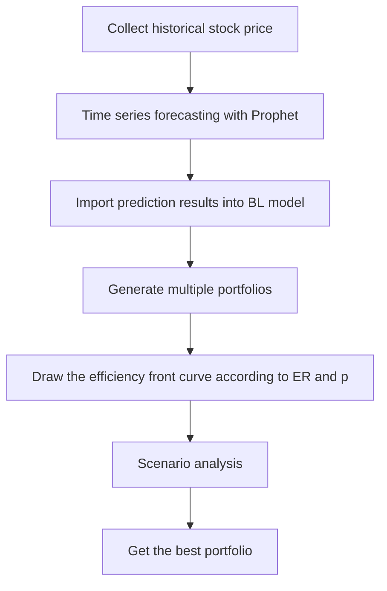

# Portfolio-Optimization

```mermaid
  flowchart  TD;
      Collect&nbsphistorical&nbspstock&nbspprice-->Time&nbspseries&nbspforecasting&nbspwith&nbspProphet;
      Time&nbspseries&nbspforecasting&nbspwith&nbspProphet-->Import&nbspprediction&nbspresults&nbspinto&nbspBL&nbspmodel;
      Import&nbspprediction&nbspresults&nbspinto&nbspBL&nbspmodel-->Generate&nbspmultiple&nbspportfolios;
      Generate&nbspmultiple&nbspportfolios-->Draw&nbspthe&nbspefficiency&nbspfront&nbspcurve&nbspaccording&nbspto&nbspER&nbspand&nbspp;
      Draw&nbspthe&nbspefficiency&nbspfront&nbspcurve&nbspaccording&nbspto&nbspER&nbspand&nbspp-->Scenario&nbspanalysis;
      Scenario&nbspanalysis-->Get&nbspthe&nbspbest&nbspportfolio;
```
