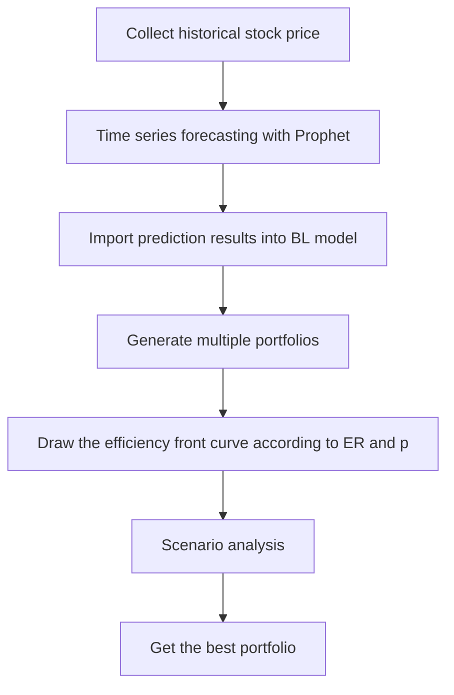

# Portfolio Optimization

  上方流程圖是我們整個研究的架構。首先會蒐集過去三年間的股票資訊，然後使用Prophet套件預測未來一週的股價，且將預測結果導入Black-Litterman模型中，創建出50組投資組合，並計算各組合的標準差、收益率與夏普值，畫出效率前緣圖，找出最佳投資組合。
## Data Information
在投資股票時，不會只投資一檔股票，會投資多檔股票將風險分散，而投資組合如何分配和會有哪些風險和收益即是本研究所要探討的內容。  本研究將時間設定從2019年到2022年，疫情影響下的股票市場，所選的10檔股票是參考2022年兆豐投信台灣晶圓製造的ETF的前十名。  歷史股價則是從yfinance獲取，並將後續模型所需的所有股票資訊匯成excel表，下圖以2330為例，包含三年間的收盤價和成交量等資訊，每檔股票都有其各自對應的excel。  

## Time Series Forecasting
Time Series Forecasting部份，我們使用prophet套件來完成，在蒐集完股票資訊後，會將它讀取到預測模型中，每檔股票會有724筆資料，而預測模型中的y是close(收盤價)，x則是high、low、open、close、volume、adj close和它們之間的交互作用。
  
上方是預測模型跑出的結果，每檔股票都會有一張表跟一張股價的走勢圖。  表中就包含了未來一週的股價，也就是裡面yhat欄位的地方。從圖中則可以得知過去三年與未來一週的股價走勢，圈起來的地方就是預測的結果。
## Black-Litterman Model  
  
Black-Litterman Model是一個在Bayes框架下的投資組合配置模型。首先透過權重算出預期收益率，並將它當成先驗，然後用先驗收益得出後驗收益，最後用後驗收益率推回理想權重。BL為投資者提供了一個導入"觀點view"的管道，同時將預期收益分散到不同步驟，增加修改的彈性，最後再進行最佳化配置。  

上圖是投資組合最佳化模型得出的效率前緣圖，x軸代表波動率(風險)，y軸代表預期收益，圖中的每個點都代表一個投資組合，根據點的顏色也可以看出每個投資組合的夏普值，顏色越淺夏普值越高。  在這50個點中，第50個點即是最佳投資組合，收益為0.0223、波動率為0.0637、夏普值為0.2794。
