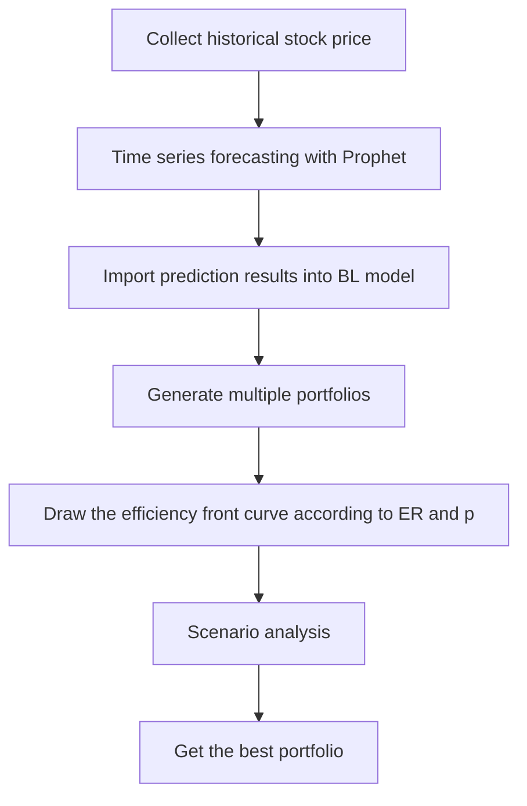

# Portfolio Optimization

## Data Information

## Time Series Forecasting
Time Series Forecasting部份，我們使用prophet套件來完成，在蒐集完股票資訊後，會將它讀取到預測模型中，每檔股票會有724筆資料，預測模型中的y是close(收盤價)，x則有high、low、open、close、volume、adj close和它們之間的交互作用。
## Black-Litterman Model
