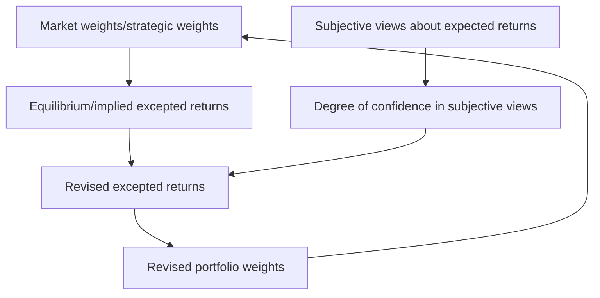

# Portfolio Optimization

## Data Information
在投資股票時，不會只投資一檔股票，會投資多檔股票將風險分散，而投資組合如何分配和會有哪些風險和收益即是本研究所要探討的內容。  本研究將時間設定從2019年到2022年，疫情影響下的股票市場，所選的10檔股票是參考2022年兆豐投信台灣晶圓製造的ETF的前十名。  歷史股價是從yfinance獲取，並將後續模型所需的所有股票資訊匯成excel表，下圖以2330為例，包含三年間的收盤價和成交量等資訊，每檔股票都有其各自對應的excel。  

## Time Series Forecasting
Time Series Forecasting部份，我們使用prophet套件來完成，在蒐集完股票資訊後，會將它讀取到預測模型中，每檔股票會有724筆資料，預測模型中的y是close(收盤價)，x則有high、low、open、close、volume、adj close和它們之間的交互作用。
  
上方是預測模型跑出的結果，每檔股票都會有一張表跟一張股價的走勢圖。  表中就包含了未來一週的股價，也就是裡面yhat欄位的地方。從圖中則可以得知過去三年與未來一週的股價走勢，圈起來的地方就是預測的結果。
## Black-Litterman Model

